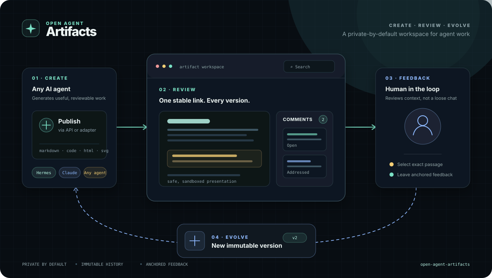

# Open Agent Artifacts

A private-by-default artifact workspace for AI agents.



The project provides a versioned catalog for agent-produced documents, code, diagrams, and other reviewable artifacts. Users can open a stable link, browse a grid or grouped list, select a passage, leave feedback, compare versions, and ask an agent to prepare a new version.

The workspace opens on a catalog with visual previews. Markdown opens as a real rendered document; HTML opens as a sandboxed visual document. An opened artifact supports immutable version publishing, pin/unpin, visible or hidden comments, highlighted comment anchors, history, and restore-as-new-version.

## Project description

Read the [English / Hungarian project description with an EN/HU switch](web/project-description.html). The live workspace root is the primary destination for artifact requests; GitHub is the source-code extra.

## Status

Early development. The first release targets static content, immutable versions, anchored comments, a local API, rendered Markdown, and sandboxed HTML presentation. Arbitrary artifact JavaScript execution is intentionally out of scope.

## Design goals

- Agent-independent core with thin client adapters.
- Local-first storage with SQLite.
- Stable artifact links and immutable version history.
- Feedback tied to the exact version and quoted context.
- Safe presentation: Markdown is allowlist-rendered; HTML is sandboxed without same-origin access, network, credentials, or artifact scripts.
- Private-by-default deployment; Tailscale can be added by the operator.

## Development

```bash
uv sync --extra dev
uv run pytest -v
```

The repository is designed to run on Python 3.11 or newer. Runtime data must live outside the repository. See `AGENTS.md` for contribution and privacy boundaries.

## Security boundary

This project is not a security guarantee for arbitrary generated code. Markdown is rendered through an allowlist parser. HTML is displayed in an opaque-origin sandbox with artifact scripts removed and a restricted CSP; arbitrary generated JavaScript is never executed. Any future interactive preview must be a separate, explicitly reviewed capability with a stronger isolation boundary.

## License

MIT. See `LICENSE`.
